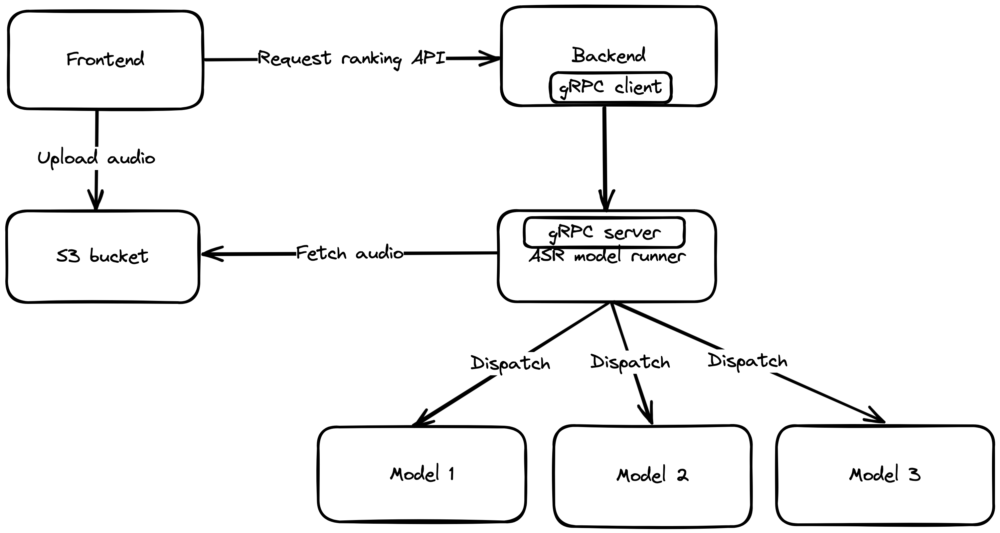

# Yetien


## Original Repo

https://github.com/Jianxuan-Li/yetien-backend-asr-grpc
https://github.com/Jianxuan-Li/yetien-backend-asr-grpc-nodejs

## Overview

This project is the ASR model server with a gRPC server

information about the project:

* Group number: 6
* Group name: Yeti
* Group members: Jianxuan Li, Dongpeng Dai, Jiffy Kuriakose
* Project name: Yetien
* Mentor name: Michael Stacey
* Project website: https://yetien.com/

## Technical details

### Design



### Technologies used

* Typescript
* gRPC
* Docker
* Kubernetes
* AWS S3

## Development

System: Windows(WSL2) / Linux / Mac

1. Clone the repo
1. `corepack prepare pnpm@8.6.9 --activate` to install pnpm
1. Run `pnpm i` to install dependencies
1. Run `pnpm start` to start development server

Some rules:

* http://betterspecs.org/
* https://www.conventionalcommits.org/en/v1.0.0/

## Test

1. Run `pnpm test` to run all tests

#### connect to development models

https://asr.yetien.com/docs#/

* save username and password into environment variables:

e.g. in `.env` file

```bash
OPEN_AI_API_KEY=sk-xxx

AWS_STORAGE_BUCKET_NAME={our bucket name}
AWS_S3_ACCESS_KEY_ID={your key id}
AWS_S3_SECRET_ACCESS_KEY={your secret key}
AWS_S3_ENDPOINT_URL=https://s3.ca-central-1.amazonaws.com
AWS_S3_REGION_NAME=ca-central-1

YETIEN_DEV_MODEL_0_ADDR=https://asr.yetien.com/model/0/asr
YETIEN_DEV_MODEL_0_USER={your username}
YETIEN_DEV_MODEL_0_PWD={your password}
```
